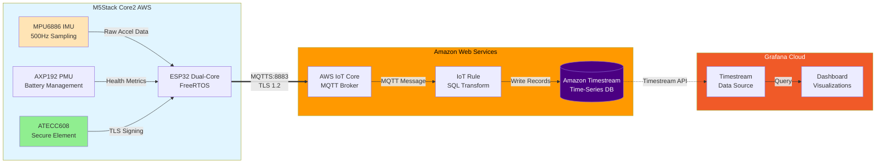

# Vibration Monitoring IoT

Industrial vibration monitoring demo: M5Stack Core2 AWS samples IMU data, computes RMS/peak acceleration, publishes to AWS IoT Core over MQTTS using the ATECC608 secure element, routes to Amazon Timestream, visualizes in Grafana Cloud.

**Use case:** "Is my washing machine/CNC/HVAC vibrating too much?"

## Architecture



### Data Flow

1. **MPU6886 IMU** samples 3-axis acceleration at 500Hz (FreeRTOS task on Core 1)
2. **ESP32** computes RMS and peak values over 1-second windows
3. **ATECC608** signs TLS handshake (private key never leaves chip)
4. **AWS IoT Core** receives JSON telemetry every 5 seconds via MQTTS
5. **IoT Rule** transforms and routes data to Timestream
6. **Grafana** queries Timestream and visualizes trends

## Security Model

The ATECC608 secure element provides hardware-backed authentication:
- **Private key never leaves the chip** - generated and stored in tamper-resistant hardware
- **Cryptographic proof of identity** - each message is signed by the device's unique private key
- **Non-repudiation** - you can prove data came from this exact device and hasn't been tampered with

This is the same security model used in hardware security keys (YubiKey, etc.) and TPM chips.

## Hardware

- **M5Stack Core2 for AWS** (not regular Core2!)
  - ESP32-D0WDQ6-V3 (dual-core 240MHz, 16MB flash)
  - MPU6886 6-axis IMU (accelerometer + gyroscope)
  - AXP192 power management IC
  - ATECC608 secure element at I2C address **0x35**
  - 320x240 IPS LCD with capacitive touch

## This Device

- **Device ID / Thing Name:** `012333B76CAC4C3701`
- **Certificate fingerprint:** `699ea81f9eb0f227f655b3b2ab03157a50677f16`
- **AWS Region:** `us-east-1`
- **IoT Endpoint:** `afujw4lyol38p-ats.iot.us-east-1.amazonaws.com`

---

## Setup Instructions

### 1. Prerequisites

- [PlatformIO](https://platformio.org/install) (VS Code extension or CLI)
- [AWS CLI v2](https://aws.amazon.com/cli/) configured with appropriate credentials
- AWS account with IoT Core access

### 2. Configure Secrets

```bash
# secrets.h is already configured for this device
# If starting fresh, copy the template:
cp src/secrets.h.example src/secrets.h
```

Edit `src/secrets.h` with:
- WiFi credentials
- AWS IoT endpoint (get from AWS Console → IoT Core → Settings)
- Device certificate (extracted from ATECC608)

### 3. Register Device with AWS IoT

#### 3a. Register the Certificate

```bash
cd /path/to/grafana-core2aws-iot

aws iot register-certificate-without-ca \
  --certificate-pem file://extras/certificates/device_new.pem \
  --status ACTIVE \
  --region us-east-1
```

Save the `certificateArn` from the output - you'll need it for the next steps.

Example output:
```json
{
    "certificateArn": "arn:aws:iot:us-west-2:123456789012:cert/abc123...",
    "certificateId": "abc123..."
}
```

#### 3b. Create the IoT Thing

```bash
aws iot create-thing \
  --thing-name "012333B76CAC4C3701" \
  --region us-east-1
```

#### 3c. Create the IoT Policy

```bash
aws iot create-policy \
  --policy-name "VibrationMonitorPolicy" \
  --region us-east-1 \
  --policy-document '{
    "Version": "2012-10-17",
    "Statement": [
      {
        "Effect": "Allow",
        "Action": "iot:Connect",
        "Resource": "arn:aws:iot:us-east-1:*:client/${iot:Connection.Thing.ThingName}"
      },
      {
        "Effect": "Allow",
        "Action": "iot:Publish",
        "Resource": "arn:aws:iot:us-east-1:*:topic/dt/vibration/${iot:Connection.Thing.ThingName}/*"
      }
    ]
  }'
```

#### 3d. Attach Policy and Thing to Certificate

```bash
# Replace <CERT_ARN> with the certificateArn from step 3a
CERT_ARN="arn:aws:iot:us-east-1:123456789012:cert/abc123..."

aws iot attach-policy \
  --policy-name "VibrationMonitorPolicy" \
  --target "$CERT_ARN" \
  --region us-east-1

aws iot attach-thing-principal \
  --thing-name "012333B76CAC4C3701" \
  --principal "$CERT_ARN" \
  --region us-east-1
```

### 4. Build and Flash Firmware

```bash
cd /path/to/grafana-core2aws-iot

# Build
pio run

# Flash (adjust COM port as needed)
pio run -t upload --upload-port COM10

# Monitor serial output
pio device monitor --port COM10 --baud 115200
```

### 5. Verify MQTT Connection

In AWS Console:
1. Go to **IoT Core** → **MQTT test client**
2. Subscribe to: `dt/vibration/+/telemetry`
3. You should see JSON messages arriving every 5 seconds

---

## AWS Backend Setup (Timestream)

### Create Timestream Database

```bash
aws timestream-write create-database \
  --database-name VibrationDB \
  --region us-east-1

aws timestream-write create-table \
  --database-name VibrationDB \
  --table-name Telemetry \
  --retention-properties \
    MemoryStoreRetentionPeriodInHours=24,MagneticStoreRetentionPeriodInDays=90 \
  --region us-east-1
```

### Create IAM Role for IoT Rule

```bash
# Create trust policy
cat > iot-timestream-trust.json << 'EOF'
{
  "Version": "2012-10-17",
  "Statement": [
    {
      "Effect": "Allow",
      "Principal": {"Service": "iot.amazonaws.com"},
      "Action": "sts:AssumeRole"
    }
  ]
}
EOF

# Create role
aws iam create-role \
  --role-name IoTTimestreamRole \
  --assume-role-policy-document file://iot-timestream-trust.json

# Attach Timestream write policy
aws iam put-role-policy \
  --role-name IoTTimestreamRole \
  --policy-name TimestreamWritePolicy \
  --policy-document '{
    "Version": "2012-10-17",
    "Statement": [
      {
        "Effect": "Allow",
        "Action": [
          "timestream:WriteRecords",
          "timestream:DescribeEndpoints"
        ],
        "Resource": "*"
      }
    ]
  }'
```

### Create IoT Rule to Route Data to Timestream

```bash
# Get your AWS account ID
ACCOUNT_ID=$(aws sts get-caller-identity --query Account --output text)

aws iot create-topic-rule \
  --rule-name VibrationToTimestream \
  --region us-east-1 \
  --topic-rule-payload '{
    "sql": "SELECT vibration.rms_g as rms_g, vibration.peak_g as peak_g, health.battery_v as battery_v, health.temp_c as temp_c, health.rssi_dbm as rssi_dbm, health.uptime_sec as uptime_sec, health.free_heap as free_heap FROM '\''dt/vibration/+/telemetry'\''",
    "actions": [{
      "timestream": {
        "roleArn": "arn:aws:iam::'$ACCOUNT_ID':role/IoTTimestreamRole",
        "databaseName": "VibrationDB",
        "tableName": "Telemetry",
        "dimensions": [
          {"name": "device_id", "value": "${topic(3)}"}
        ]
      }
    }]
  }'
```

---

## Grafana Cloud Setup

### 1. Install Amazon Timestream Plugin

In Grafana Cloud:
1. Go to **Administration** → **Plugins**
2. Search for "Amazon Timestream"
3. Install the plugin

### 2. Add Timestream Data Source

1. Go to **Connections** → **Data sources** → **Add data source**
2. Select **Amazon Timestream**
3. Configure:
   - **Authentication Provider:** Access & secret key (or use IAM role if in AWS)
   - **Access Key ID:** Your AWS access key
   - **Secret Access Key:** Your AWS secret key
   - **Default Region:** us-east-1
   - **Default Database:** VibrationDB
   - **Default Table:** Telemetry

### 3. Create Dashboard

Create a new dashboard with these panels:

#### Vibration RMS (Time Series)
```sql
SELECT time, measure_value::double as rms_g
FROM "VibrationDB"."Telemetry"
WHERE measure_name = 'rms_g'
  AND device_id = '012333B76CAC4C3701'
ORDER BY time DESC
```

#### Peak Acceleration (Time Series with Thresholds)
```sql
SELECT time, measure_value::double as peak_g
FROM "VibrationDB"."Telemetry"
WHERE measure_name = 'peak_g'
  AND device_id = '012333B76CAC4C3701'
ORDER BY time DESC
```

Add thresholds: Green < 1.5g, Yellow < 3g, Red >= 3g

#### Battery Voltage (Gauge)
```sql
SELECT measure_value::double as battery_v
FROM "VibrationDB"."Telemetry"
WHERE measure_name = 'battery_v'
  AND device_id = '012333B76CAC4C3701'
ORDER BY time DESC
LIMIT 1
```

#### Device Temperature (Gauge)
```sql
SELECT measure_value::double as temp_c
FROM "VibrationDB"."Telemetry"
WHERE measure_name = 'temp_c'
  AND device_id = '012333B76CAC4C3701'
ORDER BY time DESC
LIMIT 1
```

### 4. Create Alerts (Optional)

- **High Vibration:** RMS > 2.0g sustained for 1 minute
- **Device Offline:** No data for 5 minutes
- **Low Battery:** Battery voltage < 3.5V

---

## Telemetry Format

Published to `dt/vibration/{device_id}/telemetry` every 5 seconds:

```json
{
  "device_id": "012333B76CAC4C3701",
  "timestamp": 1704067200,
  "vibration": {
    "rms_g": 1.023,
    "peak_g": 2.456
  },
  "health": {
    "battery_v": 4.15,
    "temp_c": 32.5,
    "rssi_dbm": -65,
    "uptime_sec": 3600,
    "free_heap": 180000,
    "imu_temp_c": 28.5
  }
}
```

### Metrics Explained

| Field | Description |
|-------|-------------|
| `rms_g` | Root mean square acceleration over 1-second window (500 samples) |
| `peak_g` | Maximum instantaneous acceleration magnitude in window |
| `battery_v` | LiPo battery voltage (3.0V empty, 4.2V full) |
| `temp_c` | AXP192 PMIC internal temperature |
| `rssi_dbm` | WiFi signal strength |
| `uptime_sec` | Seconds since device boot |
| `free_heap` | Available heap memory in bytes |

---

## Project Structure

```
grafana-core2aws-iot/
├── platformio.ini          # Build configuration
├── README.md               # This file
├── src/                    # Main firmware source
│   ├── main.cpp            # Entry point, setup/loop
│   ├── secrets.h           # WiFi/AWS credentials (git-ignored)
│   ├── secrets.h.example   # Template for secrets
│   ├── config.h            # Pin definitions, timing constants
│   ├── wifi_manager.cpp/h  # WiFi connection with NTP sync
│   ├── aws_iot.cpp/h       # ATECC608 + BearSSL + MQTT
│   ├── imu_sampler.cpp/h   # 500Hz IMU sampling (FreeRTOS task)
│   ├── telemetry.cpp/h     # JSON payload builder
│   └── display_ui.cpp/h    # LovyanGFX vibration gauge display
├── docs/                   # Documentation
│   ├── CLAUDE.md           # Project context for Claude Code
│   ├── ATECC608_ARCHITECTURE.md      # Secure element deep dive
│   ├── ATECC608_CERTIFICATE_SOLUTION.md  # Certificate troubleshooting
│   └── VIBRATION_DETECTION.md        # RMS and FreeRTOS explanation
├── extras/                 # Additional tools
│   ├── extract_cert/       # Certificate extraction sketch
│   ├── generate_cert/      # Certificate generator sketch
│   └── certificates/       # Device certificates
│       └── device_new.pem  # Working certificate for AWS
├── aws/                    # AWS helper scripts
│   ├── register_cert.py    # Certificate registration script
│   ├── registration_helper.py  # Advanced registration (experimental)
│   └── timestream_writer.py    # Lambda function (not used - using IoT Rule)
├── grafana/                # Grafana Cloud dashboard
│   ├── core2_iot_vibration_dashboard.yaml  # Production dashboard (import-ready)
│   └── README.md           # Dashboard documentation and setup guide
└── .gitignore
```

---

## Generating Certificate (New Device)

If setting up a different Core2 AWS device, generate a properly formatted certificate:

```bash
cd extras/generate_cert
pio run -t upload --upload-port COMx
pio device monitor --port COMx --baud 115200
```

Copy the PEM certificate from serial output and save to `extras/certificates/device_new.pem`, then:
1. Register with AWS IoT (step 3a above)
2. Update `src/secrets.h` with the DEVICE_CERTIFICATE

**Note:** The private key never leaves the ATECC608 chip. See [docs/ATECC608_CERTIFICATE_SOLUTION.md](docs/ATECC608_CERTIFICATE_SOLUTION.md) for details.

---

## Troubleshooting

### ATECC608 init failed
- Verify you have **Core2 for AWS** (not regular Core2)
- Check I2C address is 0x35

### WiFi connection timeout
- Check SSID/password in secrets.h
- Ensure 2.4GHz network (ESP32 doesn't support 5GHz)

### MQTT connect failed
- Verify AWS endpoint in secrets.h
- Check certificate is registered and ACTIVE in AWS IoT
- Verify policy is attached to certificate
- Check thing is attached to certificate

### No data in Timestream
- Verify IoT Rule is enabled
- Check IAM role permissions
- Test with MQTT test client first

---

## Dependencies

| Library | Version | Purpose |
|---------|---------|---------|
| M5Unified | ^0.2.2 | M5Stack hardware abstraction |
| M5GFX | ^0.2.5 | Display graphics (LovyanGFX) |
| ArduinoJson | ^7 | JSON serialization |
| ArduinoECCX08 | HarringayMakerSpace fork | ATECC608 secure element |
| ArduinoBearSSL | ^1.7.2 | TLS with hardware crypto |
| ArduinoMqttClient | ^0.1.5 | MQTT client |

**Note:** Uses [HarringayMakerSpace/ArduinoECCX08](https://github.com/HarringayMakerSpace/ArduinoECCX08) fork pinned to commit `9864c4c` which has `begin(address)` support for ESP32.

---

## License

MIT
